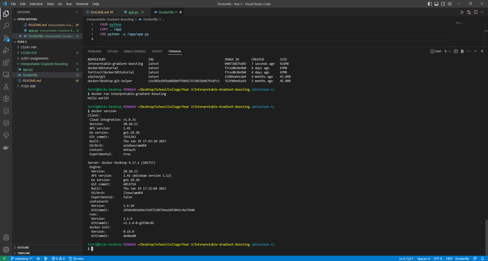
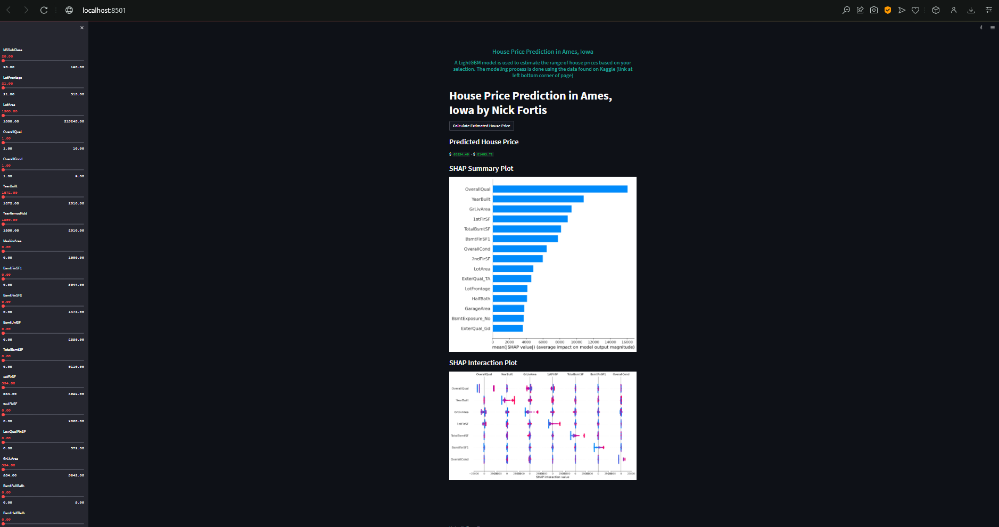

# Interpretable-Gradient-Boosting
Interpretable Gradient Boosting - Real Estate House Price Prediction
Ask a home buyer to describe their dream house, and they probably won’t begin with the height of the basement ceiling or the proximity to an east-west railroad. But this playground competition’s dataset proves that much more influences price negotiations than the number of bedrooms or a white-picket fence. With 79 explanatory variables describing (almost) every aspect of residential homes in Ames, Iowa, this competition challenges you to predict the final price of each home.

Installation instructions I followed: 
I installed Docker and WSL2 through the links provided on the repo-website, https://www.docker.com/products/docker-desktop and https://docs.microsoft.com/en-us/windows/wsl/install-win10. I already had VSC installed but needed to install the Docker and WSL extensions. I made a new repository on GitHub and cloned it to my desktop (along with adding my ssh-key to .git/config). I created app.py and Dockerfile to test my setup. It worked in a sufficient manner, but I am unsure where WSL2 comes into play in this setup.

However, I ultimately gave up on trying to use Docker for this assignment as I didn't really see a need to.

I had a lot of troubles with HF and many of my classmates did as well. We came to the consensus that it would be easier and best to just use Streamlit Cloud as did the example that was sent to us. We hope this is sufficient. The model training is a little slow so sorry about that, but you might need to wait a bit before the full website loads.

LINK TO WORKING STREAMLIT SPACE FOR MILESTONE-3: https://fortisn7-interpretable-gradient-boosting-streamlitapp-mi-1sb1gu.streamlit.app

But even using streamlit, I spent like 3 hours trying to figure out why it broke when I tried to use TreeExplainer to display my SHAP Interaction Plot. I ultimately gave up but it made no sense to me since it worked locally. I have the proof attached and I hope this is acceptable enough.

LINK TO GOOGLE SITES LANDING PAGE FOR MILESTONE-4: https://sites.google.com/njit.edu/nick-fortis/

The code that I created is for a web application that predicts the range of house prices in Ames, Iowa, based on a LightGBM model. All of the code is commented in streamlitapp.py to allow users to understand what is going on under the hood. The data is from a Kaggle competition, and the app uses Optuna to optimize the hyperparameters of the model. The app also uses SHAP (SHapley Additive exPlanations) to explain the model's predictions, by calculating the contributions of each feature to the predicted value.

First, the required libraries are imported, including Streamlit for creating the web app, Pandas for data manipulation, LightGBM for machine learning, NumPy for numerical computing, SHAP for generating explanations, Matplotlib for visualization, and Optuna for hyperparameter optimization.

Then, the load_data() function defines the objective function for Optuna to minimize, based on the LightGBM regressor, which takes hyperparameters as inputs. The function loads and preprocesses the data from the train and test CSV files, and then splits the data into training and validation sets. The model is trained with the training set and the hyperparameters, and then the mean squared error (MSE) is calculated based on the validation set. Optuna aims to minimize the MSE by adjusting the hyperparameters. After the optimization, the model is trained again with the best hyperparameters on the entire training set. Finally, SHAP is used to generate explanations of the model's predictions for the test set. However, in Streamlit Cloud I could not get the SHAP TreeExplainer to work as stated previously.

The app() function sets up the user interface for the web app using Streamlit. The left sidebar contains sliders for each feature in the training set, which the user can adjust to predict the range of house prices. The main section of the app displays the predicted range and the SHAP summary plot. At the bottom of the main section is a link to the Kaggle competition where the data came from.

Finally, I embedded the Streamlit Cloud application onto my Google Sites using html code because there was an issue where it wouldn't embed correctly unless it used a specific string at the end of the URL. There is a video in this repository titled Demo.mp4 that demonstrates the functionality of the web application.